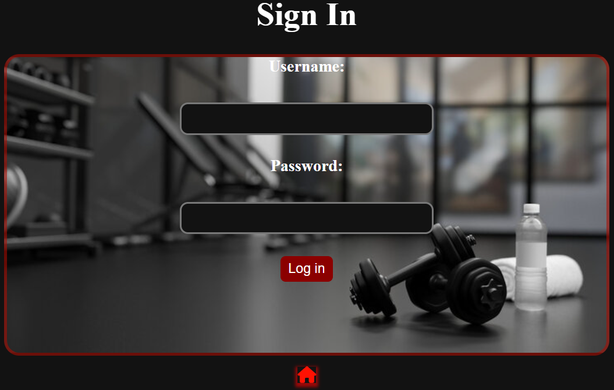
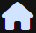
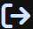
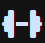
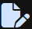
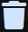

# The Okayest Fitness App

## Table of Contents
---

- [Getting_Started](#getting_started)
- [Attribution](#attribution)
- [Technologies](#technologies)
- [Next-Steps](#Next-Steps)

---
 
Welcome to The Okayest Fitness App, the app that lets you create, update, and delete workouts with ease. Whether you're putting together a new routine or tweaking an old one, FitFlow lets you add exercises, track progress, and keep things simple. No complicated features, just a straightforward way to manage your fitness plans and stay on top of your goals. Ready to get started? Let's build those workouts!  

  

Once you create an account and sign in, the app is pretty navigable. You have immediate access to your workouts page with the ability to add new workouts, and once workouts are created inside of these workouts pages you can add your own curated list of exercises with the intensity and level that you desire.

Here is a list of a few of the icons to make it as easy to understand as possible:

 

  - This button will take you back to the homepage from anywhere in the app

  - This button will take you back to the previous page from anywhere in the app

  - This button will sign you out of the application

  - This button will take you to your workouts page

  - This button will take you to the edit page for the specific workout/exercise

  - This button will delete the specific workout/exercise from the database

  - This button adds the specific workout/exercise to the database

  - This button will update the current workout/exercise in the database

 

## Getting_Started
---
 

Link To Deploy App
 

 

My Planning Board
 
[My_Trello_Board](https://trello.com/invite/b/67b271cd87c212ad418ef466/ATTI3f291c3838246faa6bf0e63d660a9342353303E5/fitness-crud-app)

## Attribution
---

Here are a few resources I used to create this applicaton.

  * MDN WebDocs
    
  * StackOverflow

  * W3Schools

  * FontAwesome ( For icons used through app )

## Technologies
---

  * Javascript

  * CSS

  * HTML

  * NPM

  * MongoDB

  * GitHub

  * Node.js

## Next-Steps
---

Here are a few things I am thinking about adding to the current app...

  *  A users community page to view other users in the databases workout pages

  *  Updated CSS styling to make it even more visually appealing

  *  Divide exercises up by the category of the exercises

  *  Possibly implement an API to easily gain other pre-made workouts that users who don't want to build their own exercises can use

