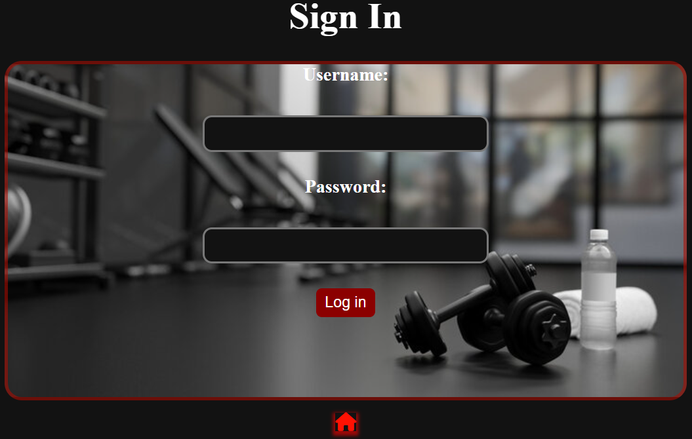

# The Okayest Fitness App

## Table of Contents
---

- [Deployment](#deployment)
- [Attribution](#attribution)
- [Technologies](#technologies)
- [Next-Steps](#Next-Steps)

Welcome to The Okayest Fitness App, the app that lets you create, update, and delete workouts with ease. Whether you're putting together a new routine or tweaking an old one, FitFlow lets you add exercises, track progress, and keep things simple. No complicated features, just a straightforward way to manage your fitness plans and stay on top of your goals. Ready to get started? Let's build those workouts!

Once you create an account and sign in, the app is pretty navigable. You have immediate access to your workouts page with the ability to add new workouts, and once workouts are created inside of these workouts pages you can add your own curated list of exercises with the intensity and level that you desire.

Here is a list of a few of the icons to make it as easy to understand as possible:
<i class="fa-solid fa-house"></i>

## Attribution

M

M

M

M

M

M

M

M

M

M

M

M

## Technologies

M

M

M

M

M

M

M

M

M

m

## Next-Steps

